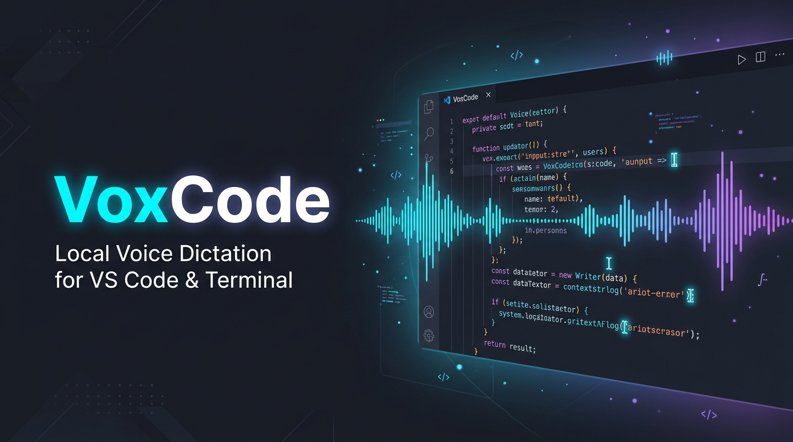
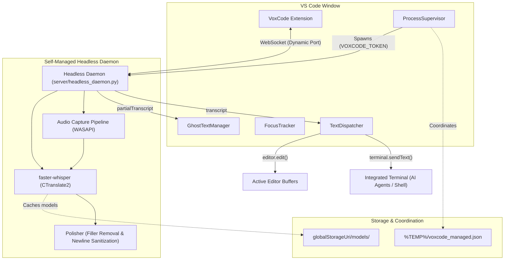

# VoxCode: Native Voice Dictation & AI Agent Steering for VS Code

<p align="center">
  
</p>

<p align="center">
  <a href="#features"></a>
  <a href="#architecture"></a>
  <a href="#features"></a>
  <a href="LICENSE"></a>
  <a href="https://marketplace.visualstudio.com"></a>
</p>

Zero-configuration, 100% offline native voice dictation and AI agent prompt steering for Visual Studio Code. VoxCode delivers zero-latency speech-to-text directly into editor buffers and the integrated terminal using local Whisper models with zero external cloud dependencies.

---

## ⚡ The Dual-Pillar Advantage

### Pillar 1: In-Editor Voice Dictation
- **Native Buffer Injection:** Direct integration into VS Code's `editor.edit()` API. Instant insertion across all active carets with full multi-cursor (`Alt+Click`) support.
- **Atomic Undo:** Hit `Ctrl+Z` once to undo an entire dictated phrase in 1 clean step, avoiding tedious letter-by-letter backspaces.
- **Smart Code vs. Prose Mode:** Automatically formats code files with lowercase identifiers and suppresses trailing periods, while preserving full sentence casing and punctuation in Markdown and commit messages.
- **AST Auto-Spacing:** Inspects preceding characters and automatically inserts spaces before identifiers so code tokens never collide.
- **Live Ghost Text:** Real-time faint italic preview (`--vscode-editorGhostText-foreground`) at cursor locations during speech streaming.

### Pillar 2: Terminal AI Agent Prompt Steering
- **Conversational Speed for CLI Agents:** Dictate multi-paragraph prompts and architectural instructions directly into **Antigravity CLI (`agy`)**, **Claude Code**, **Aider**, **OpenHands**, and **Copilot CLI** at 150 words per minute.
- **Dual Submission Modes:**
  - **Review Mode (`voxcode.terminalAutoSubmit: false` - Default):** Dictated text lands on the terminal command line for inspection, editing, or adding flags before pressing `Enter`.
  - **Auto-Submit Mode (`voxcode.terminalAutoSubmit: true`):** Dictated text is automatically committed with a trailing newline for a 100% hands-free conversational loop.
- **PTY Newline Sanitization:** Automatically collapses speech linebreaks into spaces, preventing premature execution of half-spoken prompts in interactive shells.
- **Verbal Hesitation Removal:** Filters out "um", "uh", and "ah" stutters, saving LLM context tokens and keeping instructions crisp.
- **Terminal Isolation:** Automatically suppresses editor ghost text decorations when terminal focus is active to prevent visual leaks.

---

## 🚀 Installation & Quick Start

### Option A: Install from VS Code Extensions View (Recommended)
1. Open VS Code and open the Extensions panel (<kbd>Ctrl</kbd> + <kbd>Shift</kbd> + <kbd>X</kbd> or <kbd>Cmd</kbd> + <kbd>Shift</kbd> + <kbd>X</kbd>).
2. Click the **`...`** (More Actions) menu in the top-right corner of the Extensions view.
3. Select **Install from VSIX...** and pick `voxcode-0.2.0.vsix`.
4. *Tip:* Installing through the UI automatically installs into your active **Profile**.

### Option B: Install via Terminal CLI
```bash
# Default Profile:
code --install-extension voxcode-0.2.0.vsix

# If using a specific VS Code Profile (e.g. "work"):
code --profile "work" --install-extension voxcode-0.2.0.vsix
```

### Quick Verification
1. Reload your window: <kbd>Ctrl</kbd> + <kbd>Shift</kbd> + <kbd>P</kbd> -> **`Developer: Reload Window`**.
2. Look at the bottom-right status bar: **`$(mic) VoxCode: Ready`** confirms the background engine is active.
3. Press <kbd>Ctrl</kbd> + <kbd>Alt</kbd> + <kbd>V</kbd> (or <kbd>Cmd</kbd> + <kbd>Alt</kbd> + <kbd>V</kbd> on macOS) to dictate directly into code or the terminal!

---

## ⌨️ Default Keybindings

| Keybinding (Win / Linux) | Keybinding (macOS) | Command | When Expression | Description |
| :--- | :--- | :--- | :--- | :--- |
| `Ctrl+Alt+V` | `Cmd+Alt+V` | `voxcode.toggleDictation` | `editorTextFocus` | Toggle voice dictation in editor |
| `Ctrl+Alt+V` | `Cmd+Alt+V` | `voxcode.toggleDictation` | `terminalFocus` | Toggle voice dictation in terminal |
| `Escape` | `Escape` | `voxcode.cancelDictation` | `voxcode.isRecording` | Discard current speech recording |

---

## ⚙️ Configuration Reference

Contributed settings under `voxcode`:

| Setting | Default | Options | Description |
| :--- | :---: | :--- | :--- |
| `voxcode.terminalAutoSubmit` | `false` | `true`, `false` | When `true`, automatically sends a newline (`Enter`) to execute dictated commands in the terminal. When `false`, leaves text on prompt for review. |
| `voxcode.modelSize` | `"base"` | `base`, `base.en`, `small`, `small.en`, `large-v3-turbo` | Whisper model size. English-only (`.en`) models are fastest. |
| `voxcode.device` | `"cpu"` | `cpu`, `cuda` | Compute device (`cpu` or `cuda` for NVIDIA GPUs). |
| `voxcode.computeType` | `"auto"` | `auto`, `float16`, `int8_float16`, `int8`, `float32` | Quantization compute type (`auto` selects `float16` for CUDA and `int8` for CPU). |
| `voxcode.codeMode` | `true` | `true`, `false` | Automatically lowercase keywords and strip trailing periods in code files. |
| `voxcode.autoStartDaemon` | `false` | `true`, `false` | Automatically launch local background daemon on startup if connection is refused. |
| `voxcode.serverUrl` | `"ws://127.0.0.1:7355"` | URL String | WebSocket bridge server URL for custom daemon endpoints. |
| `voxcode.daemonDirectory` | `""` | Directory Path | Optional custom directory containing `voxcode-daemon` executable or script. |

---

## ⚡ NVIDIA GPU Acceleration (CUDA)

To run heavy models like **`large-v3-turbo`** with near-zero latency (~200ms inference on an RTX 3060 Ti / 40-series GPU), set `voxcode.device` to `cuda`.

### Requirements for CUDA:
1. **NVIDIA GPU Driver** (GeForce Game Ready or Studio Driver).
2. **CUDA 12 Runtime Libraries**: CTranslate2 requires `cublas64_12.dll` and `cublasLt64_12.dll`.

### Enabling CUDA 12:
- **1-Click In-App Setup (Zero Terminal Commands):**
  Set `voxcode.device` to `cuda` in VS Code Settings, or run the Command Palette (`Ctrl+Shift+P`) command:
  > **VoxCode: Download & Install NVIDIA CUDA 12 Runtime**
  
  VoxCode will detect your NVIDIA graphics card, automatically download the official CUDA 12 runtime packages, extract them into `%LOCALAPPDATA%\VoxCode\cuda`, and restart the daemon in GPU mode.

- **Manual / Pre-Installed Options:**
  - If Python is installed: `pip install nvidia-cublas-cu12 nvidia-cudnn-cu12`
  - Or install official [NVIDIA CUDA 12.x Toolkit](https://developer.nvidia.com/cuda-downloads).
  - Or place `cublas64_12.dll` and `cublasLt64_12.dll` directly in `%LOCALAPPDATA%\VoxCode\cuda`.

### Status Bar Verification:
- **`$(mic) VoxCode: Ready (CUDA)`**: CUDA is fully active with GPU acceleration.
- **`$(mic) VoxCode: Ready (CPU Fallback)`**: CUDA was requested, but libraries were missing; fell back to CPU. Click the status bar to view diagnosis.

---

## 🏗️ Architecture Overview



See [docs/ARCHITECTURE.md](docs/ARCHITECTURE.md) for deep-dive technical details.

---

## 🛠️ Documentation

- [**Architecture Guide**](docs/ARCHITECTURE.md): Component structure, Process Supervisor, Asset Manager, and injection pipeline.
- [**Setup & Development Guide**](docs/SETUP_GUIDE.md): Local development workflow, build commands, and test suite.
- [**Configuration Reference**](docs/CONFIGURATION.md): Complete list of configuration settings, commands, and keybindings.
- [**WebSocket Protocol Specification**](docs/PROTOCOL.md): JSON protocol specification for daemon events and authentication.

---

## 🧪 Building & Verification

```bash
# Install dependencies
npm install

# Compile TypeScript
npm run compile

# Bundle with esbuild
npm run build

# Run test suite (45 unit and integration tests)
npm test

# Package standalone VSIX extension
npm run package
```

---

## 📄 License

VoxCode is open-source software licensed under the [MIT License](LICENSE).
