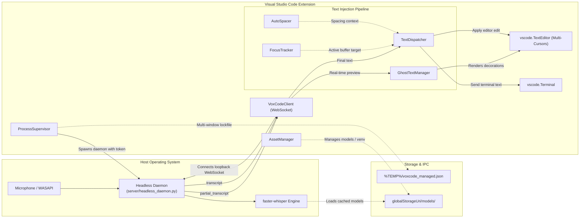
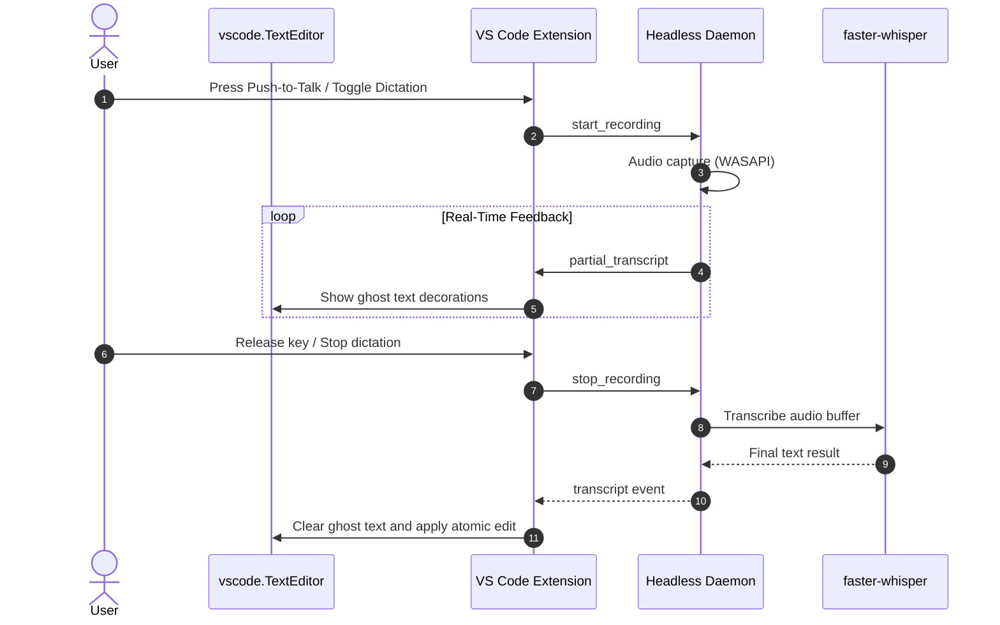

# VoxCode VS Code Extension: Architecture

This document details the architectural design, component interactions, and data flow of the **VoxCode VS Code Extension**.

---

## 1. High-Level Architecture Overview

VoxCode is a 100% self-contained, standalone Visual Studio Code extension providing native voice dictation with zero external desktop app dependencies. The extension runs its own headless speech daemon, manages dynamic loopback WebSocket ports, and injects transcribed text directly into VS Code editor buffers and integrated terminals.

### 1.1 Dictation Data Flow

---

## 2. Core Subsystems

### 2.1 Process Supervisor (`src/supervisor/processSupervisor.ts`)

The `ProcessSupervisor` coordinates the background daemon lifecycle:

- **Dynamic Port Binding**: Automatically selects a free loopback TCP port via temporary binding to port 0.
- **Ephemeral Lockfile Coordination**: Writes PID, allocated port, and security token to `%TEMP%\voxcode_managed.json`. When multiple VS Code windows are open, subsequent windows detect the active lockfile and connect directly to the running daemon without spawning duplicate processes or contending for the microphone.
- **Secure Token Passing**: Authenticates via an ephemeral 32-byte secret passed through the `VOXCODE_TOKEN` (and `VOXCODE_TOKEN`) environment variables rather than visible command-line arguments.
- **Parent Process Stdin Watchdog**: Connects child `stdio: ['pipe', 'pipe', 'pipe']`. If the extension host terminates, the child daemon detects stdin EOF and exits immediately (anti-zombie protection).

### 2.2 Asset & Environment Manager (`src/supervisor/assetManager.ts`)

The `AssetManager` isolates files and runtimes to guarantee a zero-configuration user experience:

- **Model Caching**: Whisper models are cached strictly in `context.globalStorageUri/models/` so they never pollute user home directories (`~/.cache`).
- **Binary Resolution**: Prioritizes pre-compiled standalone executables bundled in `bin/<platform-arch>/voxcode-daemon.exe`.
- **Safe Process Execution**: Uses `child_process.execFile` with argument arrays to prevent Windows quote-stripping bugs.
- **Automatic Fallback Bootstrap**: If run from source without pre-compiled binaries, auto-bootstraps an isolated virtualenv within `globalStorageUri/venv`.

### 2.3 Headless Daemon (`server/headless_daemon.py`)

A pure-Python daemon with zero GUI, PySide6, or Win32 desktop dependencies:

- **WebSockets Server**: Pure `asyncio` WebSocket server accepting authenticated connections from loopback.
- **Audio Capture Core**: `core/audio.py` low-latency gated audio capture pipeline.
- **Speech Recognition Core**: `core/engine.py` faster-whisper CTranslate2 engine.
- **Text Polisher**: `core/polisher.py` post-processing and punctuation cleanup.
- **State Management**: Built-in `SessionState` enum (`idle`, `listening`, `transcribing`, `error`).

### 2.4 WebSocket Bridge (`src/bridge/`)

- `src/bridge/client.ts`: Manages WebSocket lifecycle, message queuing, heartbeat pings (every 30s), and exponential reconnection backoff (1s to 10s).
- `src/bridge/protocol.ts`: Protocol message definitions for client actions (`authenticate`, `register`, `start_recording`, `stop_recording`, `cancel_recording`, `get_status`) and daemon events (`auth_ok`, `status_changed`, `rms_power`, `partial_transcript`, `transcript`, `error`).

### 2.5 Focus Tracking & Context Isolation (`src/focus/`)

- `src/focus/focusTracker.ts`: Captures an atomic `FocusSnapshot` whenever recording begins. Tracks whether focus belongs to an active text editor or an integrated terminal. Captures exact snapshot coordinates: document URI, active selections (supporting arbitrary multi-cursors), and language ID. Discards broadcast events if the window is not focused.

### 2.6 Text Injection Engine (`src/injector/`)

- `src/injector/textDispatcher.ts`: Translates transcribed text into editor buffer modifications or terminal input. Computes line and character advancement offsets across multiple selections simultaneously. Uses `editor.edit(...)` with `undoStopBefore: true` and `undoStopAfter: true`, allowing clean 1-step `Ctrl+Z` atomic undo.
- `src/injector/autoSpacer.ts`: Implements context-aware auto-spacing and code mode formatting (keyword lowercasing, trailing period suppression in code, natural punctuation in prose).

### 2.7 Live Ghost Text Decorations (`src/decorations/`)

- `src/decorations/ghostText.ts`: Renders real-time partial speech predictions directly at cursor positions using VS Code decoration APIs styled with `--vscode-editorGhostText-foreground`.
